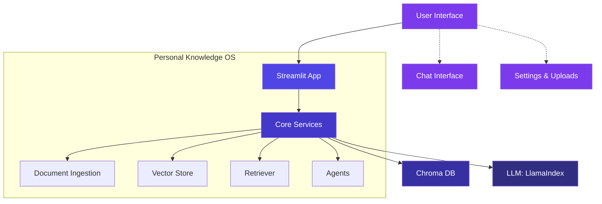

# 🧠 Personal Knowledge OS – Your Private AI Second Brain

A **fully private, persistent AI second brain** that ingests your personal knowledge (notes, PDFs, articles, thoughts) and lets you converse with it naturally.

## 🏗️ Architecture



### Component Breakdown

- **User Interface**: Streamlit-based web interface for user interaction
- **Streamlit App**: Main application handling routing and UI logic
- **Core Services**: Central processing unit managing all operations
  - **Document Ingestion**: Processes and chunks uploaded files
  - **Vector Store**: Manages vector embeddings and similarity search
  - **Retriever**: Handles query processing and context retrieval
  - **Agents**: Implements AI agent logic for complex tasks
- **Chroma DB**: Persistent vector database for document storage
- **LLM (LlamaIndex)**: Powers the AI capabilities and responses

## 🚀 Features

- **File Uploads**: Upload and index various document types (PDF, TXT, DOCX, etc.)
- **Conversational Memory**: Chat with context awareness and persistent memory
- **Knowledge Base**: Permanent storage of your information
- **Real-time Interaction**: Stream responses for a better user experience
- **Privacy Focused**: Your data remains on your device

## 🛠 Tech Stack

- **Backend**: Python 3.8+
- **Vector Database**: Chroma
- **Embeddings**: OpenAI (or compatible alternatives)
- **UI**: Streamlit
- **AI Framework**: LlamaIndex

## 📦 Installation

1. Clone the repository:
   ```bash
   git clone https://github.com/HenshawMike/personal-knowledge-os.git
   cd personal-knowledge-os
   ```

2. Create and activate a virtual environment:
   ```bash
   python -m venv venv
   source venv/bin/activate  # On Windows: venv\Scripts\activate
   ```

3. Install dependencies:
   ```bash
   pip install -r requirements.txt
   ```

4. Set up environment variables:
   Create a `.env` file in the root directory with your configuration:
   ```
   OPENAI_API_KEY=your_openai_api_key
   ```

## 🚀 Usage

1. Start the application:
   ```bash
   streamlit run app.py
   ```

2. Open your browser and navigate to `http://localhost:8501`

3. Upload your documents and start chatting with your knowledge base

## 📂 Project Structure

```
personal-knowledge-os/
├── app.py                # Main Streamlit application
├── requirements.txt      # Python dependencies
├── .env                  # Environment variables (gitignored)
├── config/
│   └── settings.py       # Application configuration
├── core/  
│   ├── ingestion.py            # File loading, chunking
│   ├── vector_store.py         # Chroma persistence
│   ├── retriever.py            # Query engine + memory
│   └── agents.py               # Tools & agent definitions
├── ui/
│   ├── sidebar.py        # Application sidebar
│   ├── chat.py           # Chat interface
│   └── dashboard.py      # Analytics and stats
├── data/
│   ├── uploads/          # Temporary file storage
│   └── chroma_db/        # Persistent vector database
└── utils/
    └── helpers.py        # Utility functions
```

## 🤝 Contributing

Contributions are welcome! Please feel free to submit a Pull Request.

## 📄 License

This project is licensed under the MIT License - see the [LICENSE](LICENSE) file for details.

## 🙏 Acknowledgments

Grateful to **God** for patience through bugs and joy in breakthroughs.

Also to the open-source AI community — LlamaIndex, Streamlit, and all builders.

## 🎮 Try It!

👉 **[Launch App](https://your-app.streamlit.app)**

Upload. Chat. Discover what your brain remembers.

Feedback welcome — let's evolve it together!

#AIEngineering #SecondBrain #RAG #LlamaIndex #Streamlit #Portfolio #BuildInPublic #FaithAndTech
